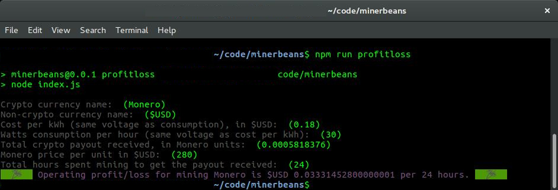
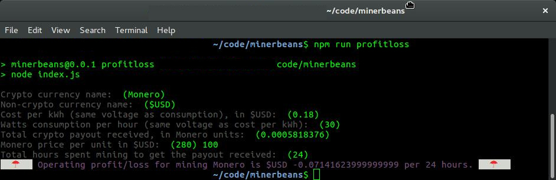

# minerbeans
Command-line tools for crypto mining accounting.

# Installation
npm i

# Usage
npm run profitloss

# Test
npm test

# Roadmap
- Ideas
  - Present a network-fetched list of cryptos for auto-complete.
  - Fetch price.
  - Based on a `.minerbeansrc` config file similar to that used in [xmr-stak](https://github.com/fireice-uk/xmr-stak), fetch payout and/or etch payout stats from mining pool
  - Use a node-based cron facility to toggle a specified local mining program if the payout gets too low.

# Contributing
- Cut a branch from `develop`.
- Ensure that your PR passes `make test`.
- Follow [these commit message conventions](https://gist.github.com/stephenparish/9941e89d80e2bc58a153#allowed-type) so that changelog is good.
